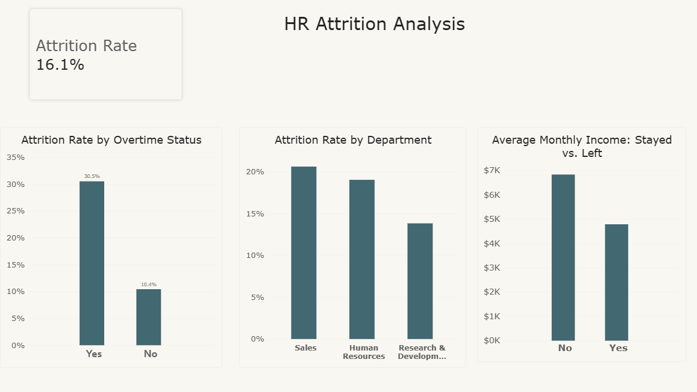

# HR Attrition Analysis — Power BI Project

**Summary:** An analysis of 1,470 employee records to identify what drives employee attrition. Built in Power BI using Power Query for data cleaning and DAX for custom metrics. Key finding: overtime, department, and income are all strongly linked to whether an employee leaves — employees working overtime leave at nearly 3x the rate of those who don't.

## Business Question
Which employee segments show the highest attrition risk, and what factors correlate most strongly with employees leaving?

## Data Source
[IBM HR Analytics Employee Attrition & Performance](https://www.kaggle.com/datasets/pavansubhasht/ibm-hr-analytics-attrition-dataset) (Kaggle) — 1,470 employee records, 35 attributes covering demographics, compensation, job role, and attrition status.

## Tools Used
Power BI Desktop (Power Query, Data Modeling, DAX)

## Data Cleaning (Power Query)
- Removed `Over18`, `EmployeeCount`, `StandardHours` — each had a single constant value across all 1,470 rows, so they carry no analytical signal (e.g., `Over18` = "Y" for every employee, `StandardHours` = 80 for every employee).
- Removed `EmployeeNumber` — a sequential row ID with no analytical value.
- Applied Currency formatting to income-related columns for readability.
- Table renamed from the default Kaggle export name to `HR` for cleaner DAX references.

## Data Model
Single flat table — each row represents one employee. No star schema was needed, as there is no repeating transactional/descriptive relationship to normalize (unlike a sales dataset with fact/dimension tables).

## Key Measures (DAX)

```dax
Attrition Rate = 
DIVIDE(
    CALCULATE(COUNTROWS('HR'), 'HR'[Attrition] = "Yes"),
    COUNTROWS('HR')
)
```
Calculates the overall percentage of employees who have left the company, using CALCULATE to isolate "Yes" attrition rows against total headcount.

## Visuals
- **Attrition Rate by Overtime Status** — Clustered column chart comparing attrition rate for employees who work overtime vs. those who don't. Uses the `Attrition Rate` measure directly on the X-axis category, relying on filter context to recalculate per category automatically.
- **Attrition Rate by Department** — Same pattern, sliced by `Department`.
- **Average Monthly Income: Stayed vs. Left** — Clustered column chart comparing average `MonthlyIncome` (aggregated as Average, not Sum) for employees who left vs. stayed.

## Key Findings
- **Overtime is strongly linked to attrition**: employees working overtime leave at a rate of **30.5%**, nearly 3x the rate of employees who don't work overtime (**10.4%**).
- **Sales has the highest departmental attrition** at **20.6%**, the highest of all departments in the dataset.
- **Lower income correlates with higher attrition**: employees who left earned an average of **$4,787/month**, about 30% less than the **$6,833/month** average for employees who stayed.

## Dashboard

